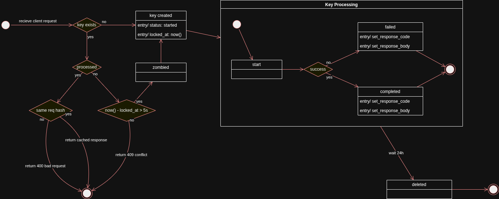
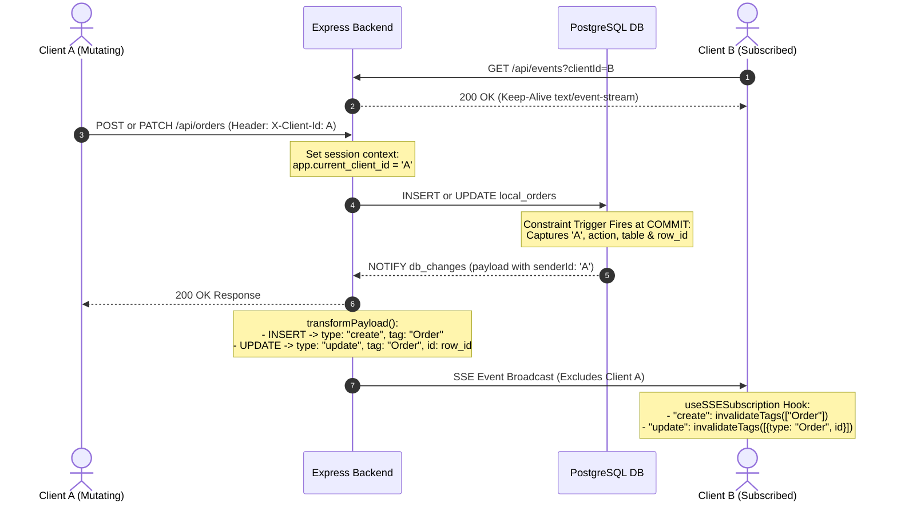
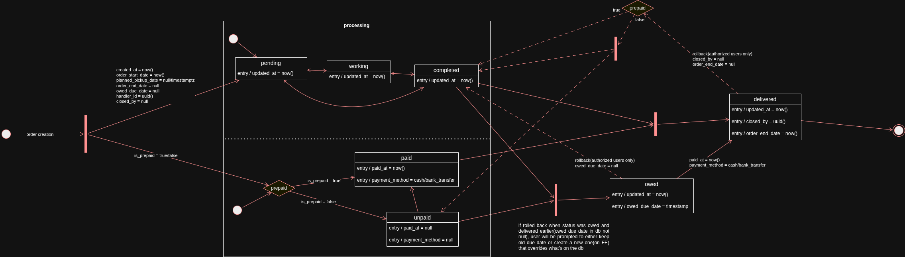
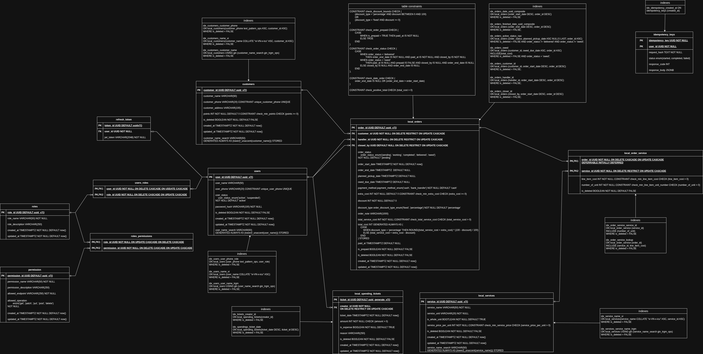
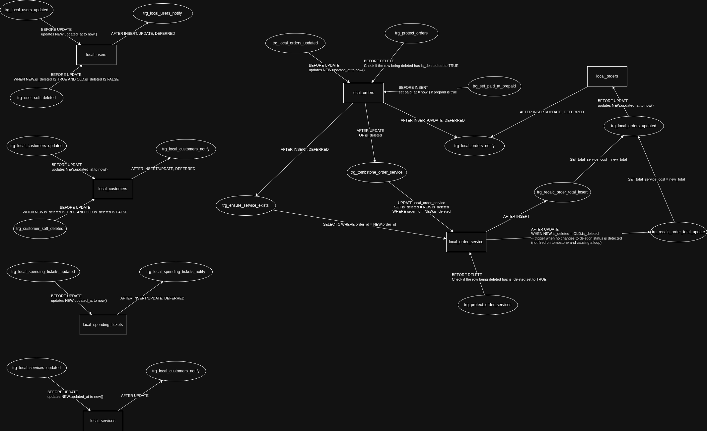

# Point-of-Sale & Service CRM System

A high-integrity, event-driven Point-of-Sale (POS) and Customer Relationship Management (CRM) platform designed for localized operational environments (on-premise mini-PC over LAN). Built with a focus on strict database-level invariants, fault-tolerant idempotency, real-time cache synchronization, and $O(\log N)$ query performance under scale.

---

## 1. Setup & Installation
## 🚀 Getting Started

Follow these instructions to get the showcase project up and running on your local machine.

### Prerequisites

Make sure you have the following installed on your system:
- [Docker Engine](https://docs.docker.com/get-docker/) (v20.10.0+)
- [Docker Compose](https://docs.docker.com/compose/install/) (v2.0.0+)

---

### Installation & Setup

1. **Clone the repository**
   ```bash
   git clone <repository-url>
   cd <repository-folder>

2. **(Optional) Configure Environment Variables**
The application comes with default configurations. If you wish to override them, create a `.env` file in the root directory:
```env
DB_USER=postgres
DB_PASSWORD=password123
DB_NAME=crm_db
JWT_SECRET=my_demo_secret

```


3. **Start the Application**
Run Docker Compose to build and launch all services (Database, Backend, and Frontend):
```bash
docker compose up --build

```


Note: On startup, the system will automatically initialize the database schema, load mock data, and run `setup.js` to configure the default admin account.


---

### Accessing the Services

Once the containers are running, you can access the various services at the following URLs:

| Service | Host Port | Description |
| --- | --- | --- |
| **Frontend** | [http://localhost:3000](http://localhost:3000) | Web Application UI |
| **Backend API** | [http://localhost:5000](http://localhost:5000) | Express / Node.js API |
| **API Documentation** | [http://localhost:8080](http://localhost:8080) | Swagger / Docs interface |
| **PostgreSQL Database** | `localhost:5432` | Postgres DB Server |
---

### Default Admin Credentials

To log in to the application for the first time, use the automatically seeded administrator account:

* **Username:** `admin`

* **Password:** `password`


---

### Useful Commands

* **Run containers in the background:**
```bash
docker compose up -d --build

```


* **View service logs:**
```bash
docker compose logs -f

```


* **Stop the application:**
```bash
docker compose down

```


* **Stop and clear database persistent data:**
```bash
docker compose down -v

```


---

## 2. System Architecture & Tech Stack

```
                                  +-----------------------+
                                  |   React + RTK Query   |
                                  |  (AntD UI Component)  |
                                  +-----------+-----------+
                                              |
                                      HTTP / SSE Stream
                                              |
                                  +-----------v-----------+
                                  |     Nginx Proxy       |
                                  +-----------+-----------+
                                              |
                                  +-----------v-----------+
                                  |   Node.js / Express   |
                                  |  (Repository Pattern) |
                                  +-----------+-----------+
                                              |
                                     pg Pool / Session
                                              |
                                  +-----------v-----------+
                                  | PostgreSQL Database   |
                                  | (Triggers, Constraints|
                                  |   LISTEN / NOTIFY)    |
                                  +-----------------------+

```

- **Frontend:** React, Redux Toolkit (RTK Query), Ant Design.
- **Backend:** Node.js, Express.js.
- **Database:** PostgreSQL 16+ (PL/pgSQL, Native Extensions: `pg_trgm`, `unaccent`).
- **Infrastructure:** Docker, Nginx Reverse Proxy.

---

## 3. Idempotency Engine & State Machine

To prevent double-billing and ghost order creation over unreliable LAN networks or client retries, POST/PUT actions pass through a PostgreSQL-backed idempotency layer with request payload hashing and automatic zombied-lock recovery.

### Execution Flow & Life Cycle


### Lock Acquisition Snippet

Lock reservation is executed using a single atomic PostgreSQL `UPSERT`:

```sql
INSERT INTO idempotency_keys (idempotency_key, user_id, request_hash, status, locked_at)
VALUES ($1, $2, $3, 'started', CURRENT_TIMESTAMP)
ON CONFLICT (user_id, idempotency_key)
DO UPDATE SET locked_at = EXCLUDED.locked_at
WHERE idempotency_keys.status = 'started'
  AND idempotency_keys.locked_at < (CURRENT_TIMESTAMP - INTERVAL '5 seconds')
RETURNING *;

```

### Key Technical Properties

- **Atomic Lock Stealing:** If a backend process crashes mid-flight, locks stuck in `'started'` state for $>5\text{s}$ are safely acquired by subsequent retries.
- **Payload Verification (`request_hash`):** Requests using an existing key with a modified payload body trigger an immediate `400 Bad Request`.
- **Transaction Binding:** Key completion (`updateSuccess`) shares the database transaction handle (`client`) of the business operation, committing key completion atomically alongside domain records.

---

## 4. Real-Time Cache Sync (PostgreSQL LISTEN/NOTIFY + SSE)

Client state synchronization avoids WebSocket overhead by leveraging PostgreSQL native pub/sub triggers linked to Express Server-Sent Events (SSE).

### Sequence Diagram



### Key Implementation Details

- **Transaction-Deferred Triggers:** DB notifications are declared as `CONSTRAINT TRIGGER ... DEFERRABLE INITIALLY DEFERRED` to guarantee events emit **only after a successful transaction commit**[cite: 1].
- **Echo Suppression:** The DB trigger extracts session metadata (`current_setting('app.current_client_id', true)`) to stamp `senderId`[cite: 1]. Express suppresses broadcasts to the originating client socket to eliminate redundant network re-fetches.
- **RTK Query Cache Mapping:** Database tables are mapped directly to frontend cache tags (e.g., `local_orders` $\rightarrow$ `Order`) to trigger selective client cache invalidations.

---

## 5. Dual-Track Order State Machine

Fulfillment tracking is decoupled from financial lifecycle rules inside an explicit state machine, enforcing strict invariants across both tracks.

### Order Life Cycle Diagram


### State Rules & Invariants

- **Fulfillment States:** `pending` $\rightarrow$ `working` $\rightarrow$ `completed` $\rightarrow$ `delivered`.
- **Financial States:** `paid` vs. `unpaid` / `owed`.
- **Prepaid Invariant:** Orders flagged as `is_prepaid = true` bypass debt checks and route straight from `completed` to `delivered`. Prepaid orders are barred from entering `owed` state.
- **Audit Enforcement:** Transitioning to `delivered` strictly mandates non-null values for `closed_by`, `paid_at`, `payment_method`, and `order_end_date` at the database constraint level.

---

## 6. Database Schema & Dependency Architecture

### Physical Schema ERD


### Trigger Dependency Graph


### Advanced Schema Features (`init.sql`)

#### 1. Recursive Loop Guards

To prevent infinite trigger cascades during nested updates (e.g., updating line items $\rightarrow$ recalculating parent order totals $\rightarrow$ triggering child updates), triggers utilize conditional execution guards:

```sql
CREATE TRIGGER trg_recalc_order_total_update
AFTER UPDATE ON local_order_service
FOR EACH ROW
WHEN (NEW.is_deleted = OLD.is_deleted) -- Suppresses cascade when soft-deleting
EXECUTE FUNCTION update_order_total_service_cost();

```

#### 2. Declarative Invariants & Generated Columns

Financial totals and validation guards are calculated natively within DDL:

```sql
-- Generated Total Cost
total_cost INT GENERATED ALWAYS AS (
    CASE
        WHEN discount_type = 'percentage' THEN ROUND((total_service_cost + extra_cost) * (100.0 - discount) / 100.0)
        ELSE (total_service_cost + extra_cost - discount)
    END
) STORED

```

#### 3. Soft-Delete PII Scrubbing

Soft-deleting records (`is_deleted = TRUE`) automatically anonymizes personally identifiable information (PII) via PL/pgSQL triggers:

```sql
CREATE OR REPLACE FUNCTION soft_delete_customer()
RETURNS TRIGGER AS $$
BEGIN
  NEW.customer_name := NULL;
  NEW.customer_phone := NULL;
  NEW.customer_address := NULL;
  NEW.points := 0;
  RETURN NEW;
END;
$$ LANGUAGE plpgsql;

```

#### 4. Accelerated Search Indexing & Collations

- **Time-Sorted PKs:** Uses `uuidv7()` for all primary keys to maintain index ordering and mitigate B-Tree index fragmentation[cite: 1].
- **Accent-Insensitive Search:** Combines `pg_trgm` GIN indexes with stored generated columns (`f_unaccent(lower(...))`) and ICU Vietnamese collations (`"vi-VN-x-icu"`).
- **Partial Covering Indexes:** Filters out deleted rows (`WHERE is_deleted = FALSE`) and includes covering payloads (`INCLUDE(...)`) to allow zero-heap Index-Only Scans.

---

## 7. Data Access Strategy

### Cursor-Based (Keyset) Pagination

All list endpoints enforce base64-encoded cursor tokens containing a primary sorting value and a unique tiebreaker ID (`cursorValue` + `cursorId`).

- **$O(\log N)$ Execution Cost:** Avoids the performance penalties of offset-based pagination (`OFFSET N LIMIT M`) by jumping directly to index tuples.
- **Drift Protection:** Guarantees deterministic result pages during concurrent record creations and soft deletions.

---

## 8. Performance Profiling & Seeding Validation

Query performance was benchmarked using a seed dataset (`mockdata.sql`) simulating multi-year operational activity.

### Dataset Composition

- **100,000** Orders (`local_orders`) spanning 7 years of operational history.
- **140,000+** Line items (`local_order_service`).
- **2,000** Customers (`customers`) structured using a Pareto distribution curve (5% VIP, 15% Regular, 80% Occasional).
- **5,000** Financial records (`local_spending_tickets`).

### Execution Plan Benchmarking

Index efficiency was verified using `EXPLAIN ANALYZE` following automated database statistic generation (`ANALYZE`):

- Verified transition from $O(N)$ Sequential Scans to $O(\log N)$ Index Scans across the 100k row dataset.
- Confirmed Index-Only Scan execution on debt lookups via covering partial index `idx_orders_owed`.
